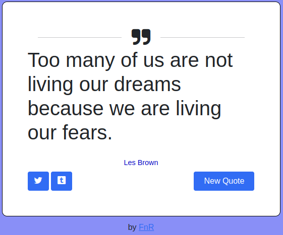

# **Random Quote Machine**

> App which randomly shows quotes from different authors.

Available live [here](https://fernet87.github.io/random-quote-machine//) 

## About the Project

  

This is a Vanilla Javascript app for [freeCodeCamp](https://www.freecodecamp.org/learn/front-end-development-libraries/front-end-development-libraries-projects/build-a-random-quote-machine) Front End Development Libraries project.
With app you can get quotes randomly by clicking the 'New Quote' button.

## **Technologies used for this project.**

  
